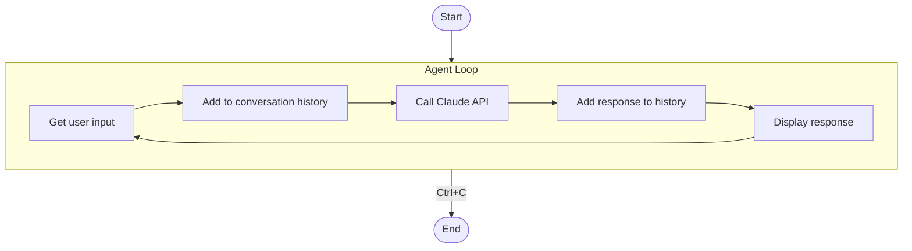
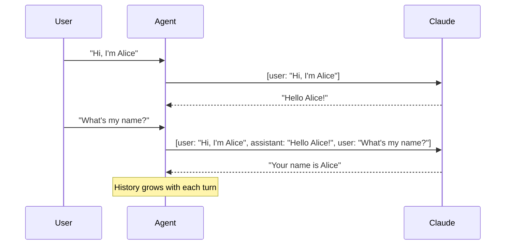

# Step 02: Interactive Chatbot

Build an interactive chat that maintains conversation history.

## What You Learn

- The agent loop pattern
- Maintaining conversation history
- Multi-turn conversations

## How It Works



## Conversation History

The key insight: Claude is stateless. To maintain context, we send the **entire conversation** with each request.



## Run It

```bash
mise run js:step-02
```
