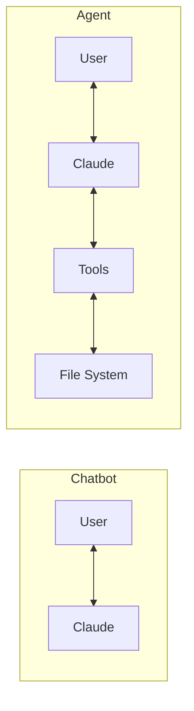
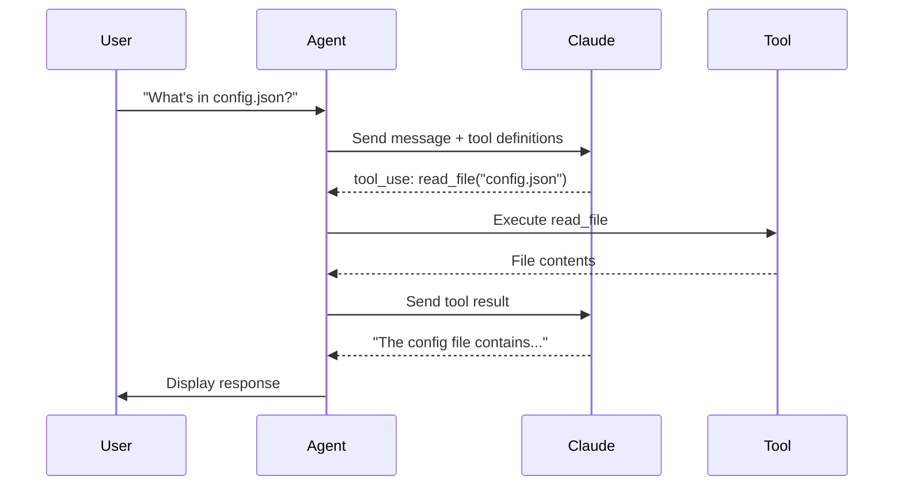
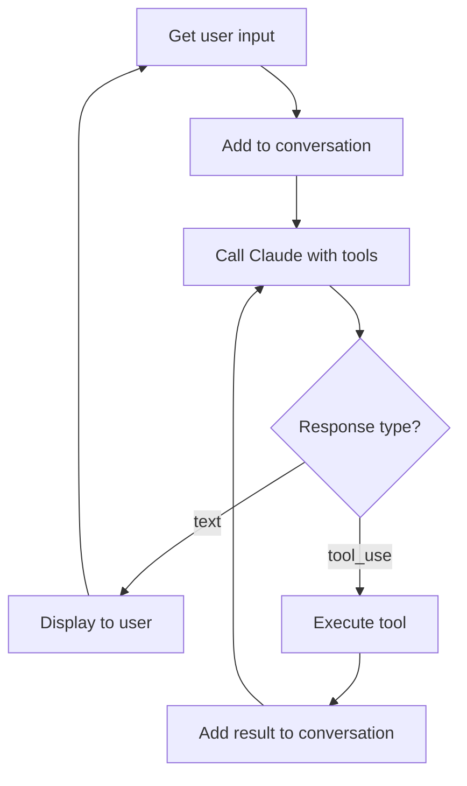
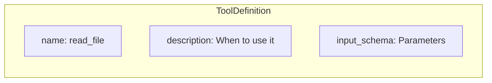

# Step 03: Adding Tools - read_file

This is where the chatbot becomes an **agent** - it can now take actions!

## What You Learn

- Defining tools for Claude
- Executing tool calls
- The tool use loop
- JSON Schema for parameters

## What Makes This an Agent?

An agent is an LLM that can **take actions** in the world. By giving Claude the `read_file` tool, it can now access information outside its context window.



## How Tool Use Works



## The Enhanced Agent Loop



## Tool Definition Structure



## Run It

```bash
mise run js:step-03
```

Try asking: "What's in index.js?" or "Read the package.json file"
