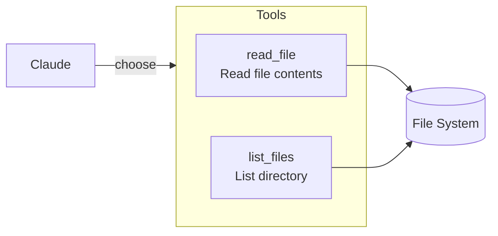
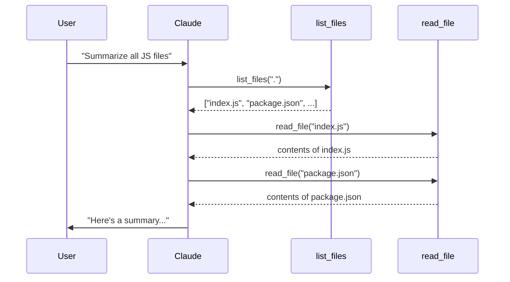

# Step 04: Multiple Tools - list_files

Add a second tool so Claude can explore the filesystem.

## What You Learn

- Adding multiple tools is trivial
- Tools work together naturally
- Claude decides which tool to use

## Available Tools



## How Claude Uses Multiple Tools

Claude can chain tools together to accomplish complex tasks:



## Code Change

The only code change from Step 03:

```javascript
// Step 03
const tools = [readFileTool];

// Step 04 - just add to the array!
const tools = [readFileTool, listFilesTool];
```

## Run It

```bash
mise run js:step-04
```

Try asking: "What files are in this directory?" or "Find and read all .js files"
