# Step 05: Complete Agent - edit_file

The final piece: Claude can now **create and modify files**.

## What You Learn

- File editing with search/replace
- Creating new files
- A complete coding agent in ~200 lines!

## The Complete Agent


## Agent Capabilities

| Capability | Tool | Example |
|-----------|------|---------|
| **Explore** | list_files | "What's in this project?" |
| **Understand** | read_file | "How does index.js work?" |
| **Modify** | edit_file | "Fix this bug" |

## The edit_file Tool

Uses search/replace for precise edits:


## Complete Agent Loop


## Example: Bug Fix Workflow

```mermaid
sequenceDiagram
    participant User
    participant Claude
    participant Tools

    User->>Claude: "Fix the typo in index.js"

    Claude->>Tools: list_files(".")
    Tools-->>Claude: [index.js, ...]

    Claude->>Tools: read_file("index.js")
    Tools-->>Claude: File with typo

    Claude->>Tools: edit_file(path, old="teh", new="the")
    Tools-->>Claude: OK

    Claude->>User: "Fixed the typo 'teh' → 'the'"
```



## Run It

```bash
mise run js:step-05
```

Try asking:
- "Create a hello.txt file with a greeting"
- "Add a comment to index.js explaining what it does"
- "Find and fix any typos in the README"
