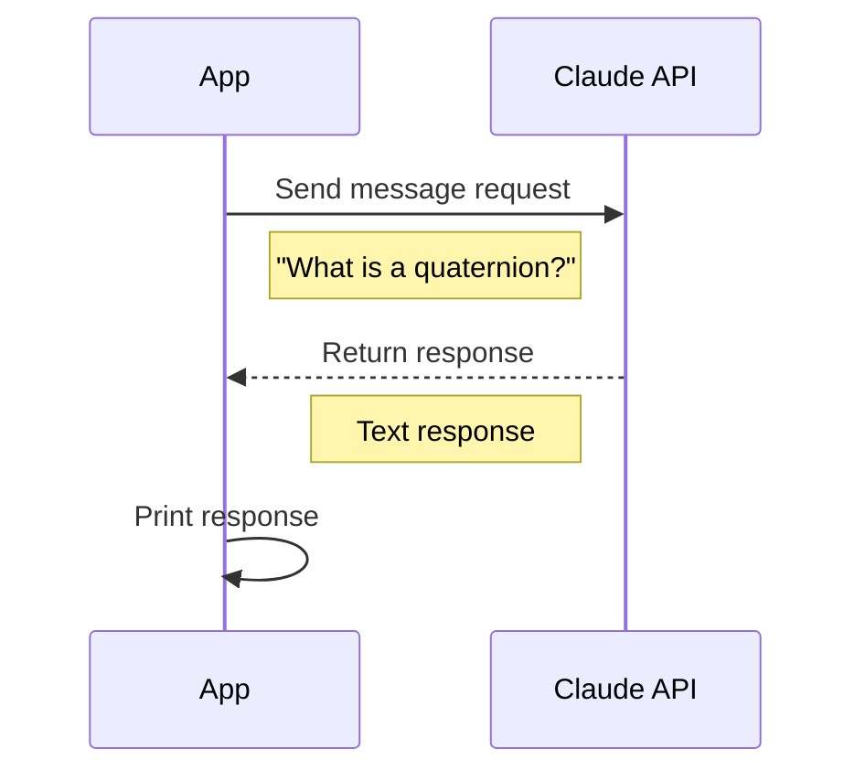
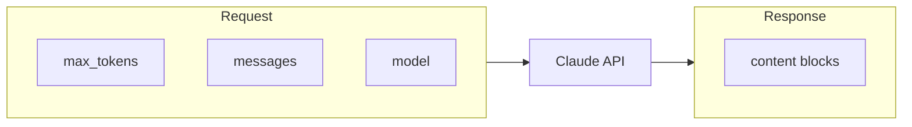

# Step 01: Hello Claude

Your first API call to Claude - the foundation of everything.

## What You Learn

- Creating an Anthropic client
- Structuring a message request
- Handling the response

## How It Works



## Key Components



## Run It

```bash
mise run ruby:step-01
```
